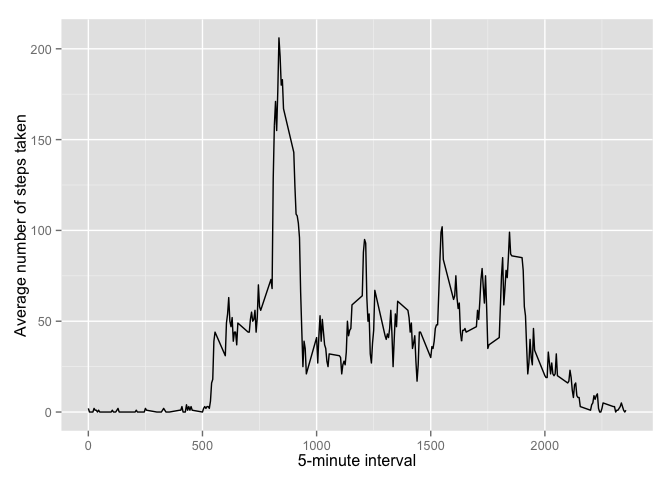

# Reproducible Research: Peer Assessment 1


## Loading and preprocessing the data
This code loads the data and sets the right data classes.

```r
data <- read.csv("activity.csv", colClasses = c("integer","Date","integer"))
head(data)
```

```
##   steps       date interval
## 1    NA 2012-10-01        0
## 2    NA 2012-10-01        5
## 3    NA 2012-10-01       10
## 4    NA 2012-10-01       15
## 5    NA 2012-10-01       20
## 6    NA 2012-10-01       25
```

## What is mean total number of steps taken per day?
For this part of the assignment, we ignore the missing values in the dataset.

1. Calculate the total number of steps taken per day.

    
    ```r
    library(dplyr)
    ```
    
    ```
    ## 
    ## Attaching package: 'dplyr'
    ## 
    ## The following objects are masked from 'package:stats':
    ## 
    ##     filter, lag
    ## 
    ## The following objects are masked from 'package:base':
    ## 
    ##     intersect, setdiff, setequal, union
    ```
    
    ```r
    total_steps_per_day <- summarise(group_by(data,date), total.steps = sum(steps, na.rm = TRUE))
    total_steps_per_day
    ```
    
    ```
    ## Source: local data frame [61 x 2]
    ## 
    ##          date total.steps
    ## 1  2012-10-01           0
    ## 2  2012-10-02         126
    ## 3  2012-10-03       11352
    ## 4  2012-10-04       12116
    ## 5  2012-10-05       13294
    ## 6  2012-10-06       15420
    ## 7  2012-10-07       11015
    ## 8  2012-10-08           0
    ## 9  2012-10-09       12811
    ## 10 2012-10-10        9900
    ## ..        ...         ...
    ```

2. Make a histogram of the total number of steps taken each day.

    
    ```r
    library(ggplot2)
    ggplot(data = total_steps_per_day, aes(x = total.steps)) + geom_histogram(binwidth = 2000) + ggtitle("Distribution of total number of steps taken per day") + xlab("Steps taken per day") + ylab("Number of days") + scale_x_continuous(breaks = seq(0,24000,2000))
    ```
    
     

3. Calculate and report the mean and median of the total number of steps taken per day

    Mean of the total number of steps taken per day:
    
    ```r
    round(mean(total_steps_per_day$total.steps))
    ```
    
    ```
    ## [1] 9354
    ```

Median of the total number of steps taken per day:

```r
median(total_steps_per_day$total.steps)
```

```
## [1] 10395
```

## What is the average daily activity pattern?
1. Make a time series plot (i.e. type = "l") of the 5-minute interval (x-axis) and the average number of steps taken, averaged across all days (y-axis)


```r
avg_steps_by_interval <- summarise(group_by(data,interval), avg.steps = round(mean(steps, na.rm = TRUE)))
ggplot(data = avg_steps_by_interval, aes(x = interval, y = avg.steps)) + geom_line() + xlab("5-minute interval") + ylab("Average number of steps taken")
```

 

2. Which 5-minute interval, on average across all the days in the dataset, contains the maximum number of steps?

The interval containing the maximum number of steps is interval 835.

```r
head(arrange(avg_steps_by_interval, desc(avg.steps)),1)
```

```
## Source: local data frame [1 x 2]
## 
##   interval avg.steps
## 1      835       206
```

## Imputing missing values

1. Calculate and report the total number of missing values in the dataset (i.e. the total number of rows with NAs)


```r
sum(is.na(data$steps))
```

```
## [1] 2304
```

2. Devise a strategy for filling in all of the missing values in the dataset. The strategy does not need to be sophisticated. For example, you could use the mean/median for that day, or the mean for that 5-minute interval, etc.

Strategy for imputing missing values is to impute with the average number of steps for the 5-minute interval that it is in.

3. Create a new dataset that is equal to the original dataset but with the missing data filled in.

Create a copy of the data to be imputed with interval average. Then create a mapper to map interval to the average steps.


```r
testdata_avg <- data
map <- left_join(testdata_avg, avg_steps_by_interval, by = c("interval"))
```

Impute NA values with average steps given the interval that the NA was in.

```r
suppressWarnings(testdata_avg$steps[is.na(testdata_avg$steps)] <- map$avg.steps[map$interval == testdata_avg$interval[is.na(testdata_avg$steps)]])
tbl_df(testdata_avg)
```

```
## Source: local data frame [17,568 x 3]
## 
##    steps       date interval
## 1      2 2012-10-01        0
## 2      0 2012-10-01        5
## 3      0 2012-10-01       10
## 4      0 2012-10-01       15
## 5      0 2012-10-01       20
## 6      2 2012-10-01       25
## 7      1 2012-10-01       30
## 8      1 2012-10-01       35
## 9      0 2012-10-01       40
## 10     1 2012-10-01       45
## ..   ...        ...      ...
```


4. Make a histogram of the total number of steps taken each day and Calculate and report the mean and median total number of steps taken per day. Do these values differ from the estimates from the first part of the assignment? What is the impact of imputing missing data on the estimates of the total daily number of steps?

Histogram of the total number of steps taken each day:


```r
total_steps_per_day_recalc <- summarise(group_by(testdata_avg,date), total.steps = sum(steps))
ggplot(data = total_steps_per_day_recalc, aes(x = total.steps)) + geom_histogram(binwidth = 2000) + ggtitle("Distribution of total number of steps taken per day after imputation") + xlab("Steps taken per day") + ylab("Number of days") + scale_x_continuous(breaks = seq(0,24000,2000))
```

 

Mean of the total number of steps taken per day:

```r
round(mean(total_steps_per_day_recalc$total.steps))
```

```
## [1] 10766
```

Median of the total number of steps taken per day:

```r
median(total_steps_per_day_recalc$total.steps)
```

```
## [1] 10762
```

The mean and median differ from the estimates of the first part of the assignment in that the values now are a bit higher. The mean and median are also much closer to each other than the estimates. By imputing the missing values, we're are able to provide better estimates based on historical data.

## Are there differences in activity patterns between weekdays and weekends?

1. Create a new factor variable in the dataset with two levels – “weekday” and “weekend” indicating whether a given date is a weekday or weekend day.


```r
testdata_avg <- mutate(testdata_avg, day_type = as.factor(ifelse(weekdays(date) == c("Saturday","Sunday"),"Weekend","Weekday")))
```

2. Make a panel plot containing a time series plot (i.e. type = "l") of the 5-minute interval (x-axis) and the average number of steps taken, averaged across all weekday days or weekend days (y-axis). See the README file in the GitHub repository to see an example of what this plot should look like using simulated data.


```r
avg_steps_by_interval_recalc <- summarise(group_by(testdata_avg, interval, day_type), avg.steps = mean(steps))
ggplot(data = avg_steps_by_interval_recalc, aes(x = interval, y = avg.steps)) + geom_line() + facet_grid(day_type ~ .) + ylab("Average number of steps taken")
```

 
